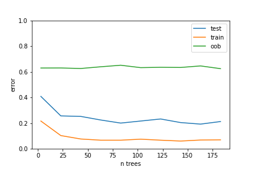
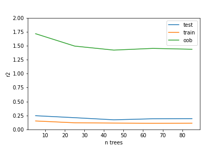

## Random-Forest

Leo Braiman's algorithm.  

You can follow video on my YuoTube

It is an enssemble of Decision Trees for regression and classification problem.
The main idea is - base model should have low bias and high variance. But all trees in enssemble should not correlate to each over.
In this case enssemble will not overfit. 
Thus, the more models in enssemble the higher score.

How to eliminate correlaton between trees?
- randomly select features in their nodes while train them
- fit each trees on bootsrapped samples 

Error for classification problem (no overfitting).

Error for regression problem.

